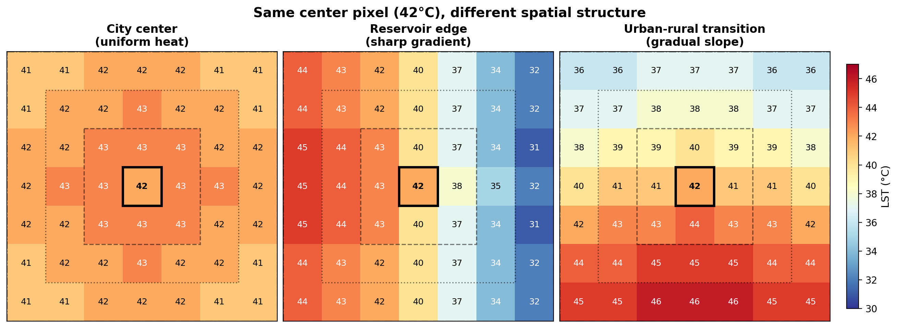
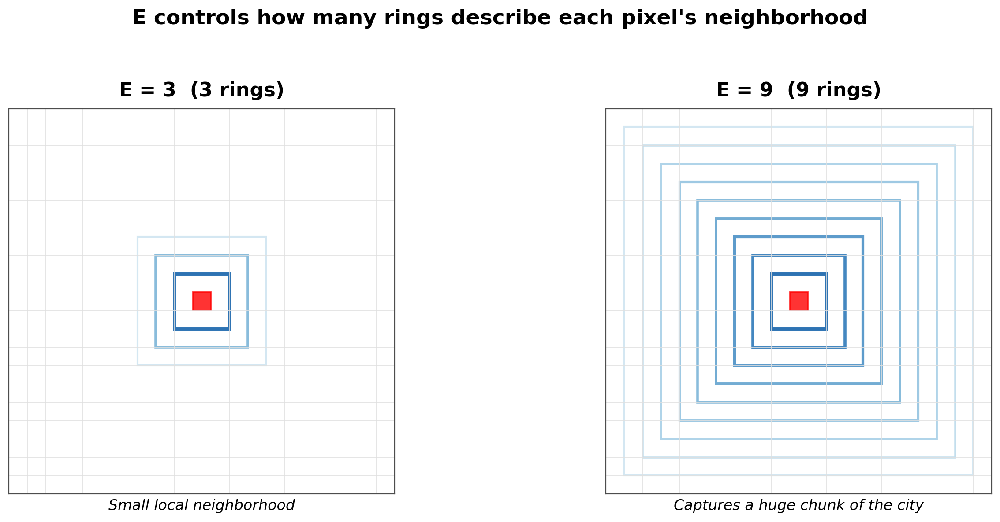
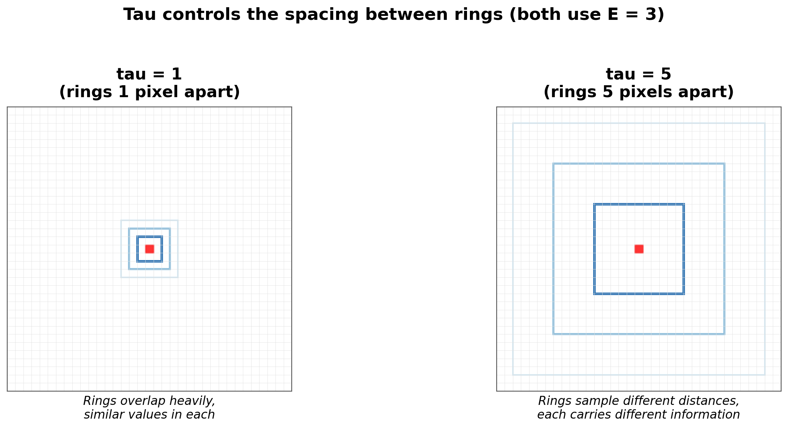
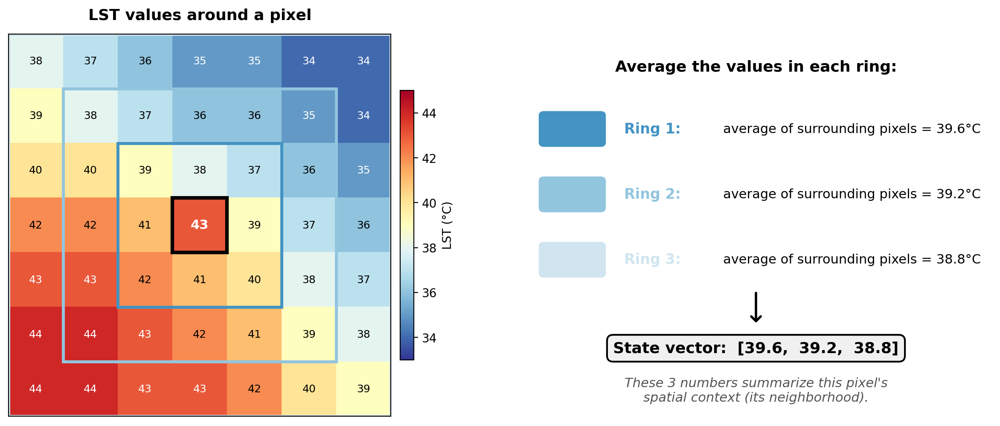
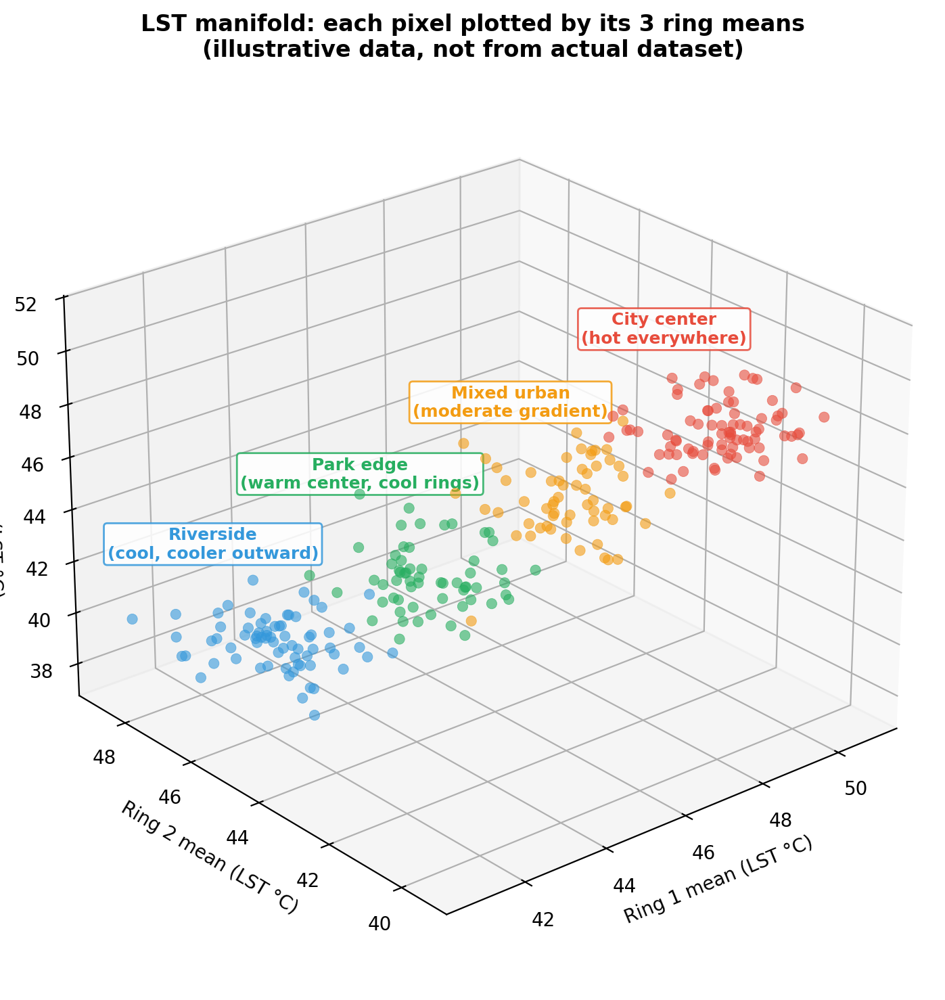
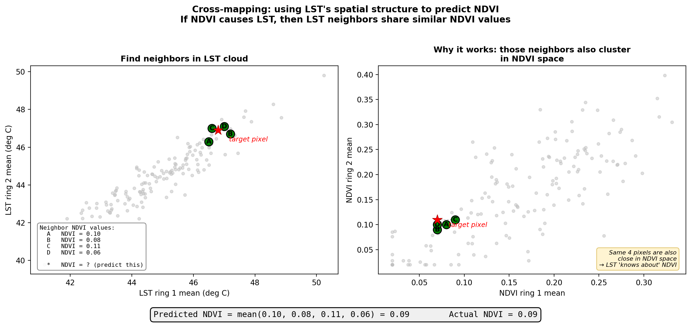
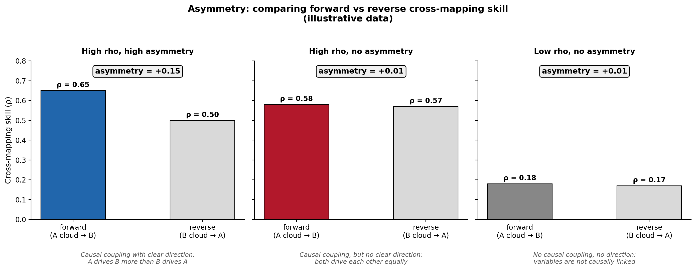
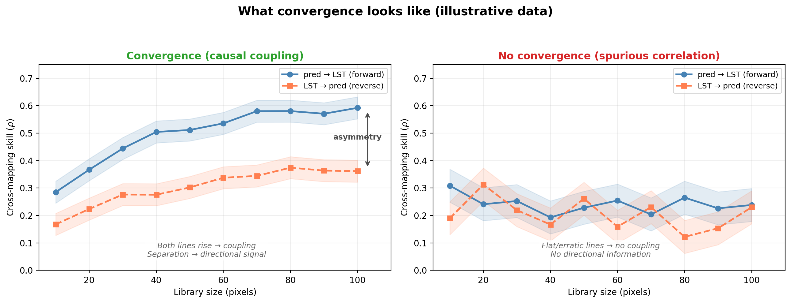

This document explains the ideas behind GCCM as far as I understand
them. I am by no means an expert on this, so please question anything
that doesn't make sense and reach out if you have questions.

---

# What is GCCM?

GCCM (Geographical Convergent Cross Mapping) is a method for testing
**causal relationships** between spatial variables. It tests whether one 
spatial variable *causally influences* another. It was introduced
by Gao et al. (2023) and builds on Convergent Cross Mapping
(Sugihara et al. 2012), a causal test originally designed for ecological
time series. CCM is for temporal data, GCCM is for spatial data.

**GCCM in 8 steps:**

1. [Describe each pixel by concentric ring means](#step1)
2. [Get a state vector per pixel (vector of E numbers from E rings)](#step2)
3. [Plot all pixels in E-dimensional space: the point cloud](#step3)
4. [Find nearest neighbors in cloud (similar spatial context)](#step4)
5. [Predict target pixel values using weighted average of neighbors](#step5)
6. [Cross-map: use one variable's cloud to predict another variable](#step6)
7. [Compare forward vs reverse rho (asymmetry test)](#step7)
8. [Check convergence: does rho increase with more data?](#step8)

---

# Step 1: Every pixel has a spatial context {#step1}

A single pixel value (e.g. surface temperature = 42°C) tells you
nothing about its surroundings. Is it in the city center? Near a park?
On a hillside? 

Consider three pixels that all have LST = 42 degrees C. They could
have very different spatial contexts:

- **Pixel in the city center:** surrounded by other hot pixels in
  every direction. Uniform heat.
- **Pixel at the edge of a reservoir:** hot on the city side, much
  cooler toward the water. A sharp gradient.
- **Pixel in a transitional zone:** warm neighbors to the south
  (built-up), cooler to the north (farmland). A gradual slope.

\newpage

These three pixels have the same value, but their neighborhoods tell
completely different stories.

GCCM's key idea: **describe each pixel not just by its own value, but
by the pattern of values around it.**

It does this using **concentric rings** around each pixel. Two parameters 
control the rings:

| Parameter | What it is | What it controls |
|-----------|-----------|-----------------|
| **E** | embedding dimension | How many rings (dimensionality of the state vector) |
| **tau** | spatial lag | Spacing between rings (in pixels) |

E and tau control how much spatial context is used to describe each
pixel. They are the two most important choices in the analysis.

{ width=80% }

{ width=80% }

For example, with E=3, each pixel gets described by 3 numbers, but
the spatial context changes if you change the distance between each
ring (tau). With a smaller tau, the pixel is described by its local
surroundings, but with larger tau, it is described in the context of
a larger area.

{ width=70% }

---

# Step 2: Build a "state vector" for each pixel {#step2}

Take one pixel of LST. Look at the mean temperature in each of its 3 rings:

The **state vector** for this pixel is **(39.6, 39.2, 38.8)** - three
numbers that summarize its spatial neighborhood. 

A pixel in a hot built-up area might have a state vector like **(48, 47, 45)**,
indicating hot surroundings at all distances.

A pixel near a park might have **(44, 38, 37)**, showing a drop from the first
ring where the park starts.

**The state vector captures the surrounding spatial pattern, not
just the pixel's own value.**

---

\newpage

# Step 3: Plot all pixels in 3D (or E-D): the "point cloud" {#step3}

Make a state vector for every pixel in the raster. Each pixel becomes
a point in 3D space (because E=3 gives 3 coordinates). The collection
of all these points is the **manifold**, a cloud of dots.

{ width=80% }

**Pixels from similar neighborhoods end up close together in the
cloud.** Two pixels from the hot city center will have similar ring means, so
they'll be near each other. A pixel near the river will be in a
different part of the cloud.

---

\newpage

# Step 4: Nearest-neighbor prediction {#step4}

Pick any pixel in the cloud. Its **nearest neighbors** are the pixels
whose spatial contexts look most similar (closest in Euclidean
distance in 3D).

**Concrete example** with 5 pixels:

| Pixel | LST | Ring 1 | Ring 2 | State vector |
|-------|-----|--------|--------|--------------|
| A | 42 | 41 | 39 | (42, 41, 39) |
| B | 38 | 37 | 36 | (38, 37, 36) |
| C | 42 | 40 | 38 | (42, 40, 38) |
| D | 30 | 31 | 33 | (30, 31, 33) |
| E | 35 | 36 | 37 | (35, 36, 37) |

**How close are A and C in the cloud?**

distance = sqrt((42-42)² + (41-40)² + (39-38)²) = sqrt(0 + 1 + 1) =
**1.41**

**How close are A and D?**

distance = sqrt((42-30)² + (41-31)² + (39-33)²) = sqrt(144 + 100 +
36) = **16.7**

C is much closer to A - they have similar spatial contexts. D is far
away - very different surrounding neighborhood.

**Important:** "neighbors" here means similar spatial context, NOT
geographically close on the map. Pixel A could be in the north and
pixel C in the south, but if their local neighborhoods look alike, they
sit near each other in the cloud.

The number of neighbours chosen is determined by E + 1.

---

# Step 5: Predict using a weighted average {#step5}

To predict pixel A's value, find its E+1 = 4 nearest neighbors and
take a weighted average (closer neighbors count more):

| Neighbor | Distance to A | LST value | Weight (normalized 1/dist) |
|----------|--------------|-----------|---------------------------|
| C | 1.41 | 42°C | 0.68 (high - very close) |
| B | 6.40 | 38°C | 0.15 |
| E | 8.83 | 35°C | 0.11 |
| D | 16.73 | 30°C | 0.06 (low - far away) |

**Predicted LST for pixel A** = weighted average = **39.9°C**

Actual value = 42°C. Close but not perfect.

Do this for every pixel. Correlate predicted vs actual values. That
correlation is **rho**, or the prediction skill.

---

# Step 6: The causal test - cross-mapping {#step6}

So far we've been predicting LST from LST's own cloud. That's just
spatial interpolation.

**The GCCM test asks something more interesting:** Can we use the 
LST cloud to predict **NDVI** values?

### How cross-mapping works

1. Build two separate clouds: one from LST ring means, one from
   NDVI ring means
2. Pick a pixel. Find its nearest neighbors in the **LST cloud**
3. But instead of looking up those neighbors' LST values, look up
   their **NDVI values**
4. Predict NDVI as a weighted average of those neighbor NDVI values

If this works well (high rho), it means LST's spatial structure
contains information about NDVI. Why would it? Because **if NDVI
drives LST, then NDVI's fingerprint is embedded in LST's spatial 
pattern.** 

**What do we mean by "fingerprint"?** Think of it like a stamp that
makes an imprint on something else, like clay. NDVI is the stamp,
LST is the clay that has NDVI's imprint embedded in it. Or thought of
another way: If a teacher (NDVI) influences student essays (LST), you 
can read the essays and infer things about the teacher, that is the 
teacher's style is embedded in the students' writing. But you can't 
look at the teacher and infer exactly what's in each essay.

### The counterintuitive direction

| Test | Source cloud | Predicts | Tests the hypothesis |
|------|-------------|----------|---------------------|
| Forward | LST cloud | NDVI values | **NDVI causes LST** |
| Reverse | NDVI cloud | LST values | **LST causes NDVI** |

To test "does NDVI cause LST?", you use **LST's cloud** to predict
**NDVI**. This feels backwards, but the logic is: if NDVI drives LST,
then NDVI's causal fingerprint is embedded in LST's spatial structure,
so LST's cloud can reconstruct NDVI.

---

# Step 7: The asymmetry test - which direction is causal? {#step7}

Both directions will usually show *some* prediction skill (because
correlated variables always share information). The question is:
**which direction is stronger?**

**Asymmetry** = forward rho − reverse rho

| Asymmetry | Meaning |
|-----------|---------|
| Positive | The predictor drives LST |
| Negative | LST drives the predictor (or unclear) |
| Near zero | Can't distinguish direction |

---

# Step 8: Convergence - the signature of causality {#step8}

One more piece separates true causality from correlation:
**convergence**.

Two variables can be correlated without either causing the other
(e.g. both driven by a third factor). Cross-mapping will show *some*
skill in both directions for any correlated pair. Convergence
separates real causal links from spurious correlations.

GCCM repeats the cross-mapping at different **library sizes** (how
many pixels to include). If rho *improves* as we add more pixels,
that's convergence.

**Why convergence matters:** With more data points, the cloud becomes
denser and neighbors become more precise. For a truly causal
relationship, better neighbors = better predictions. For a spurious
correlation, more data doesn't help - rho stays flat.

\newpage

| Pattern | Interpretation |
|---------|---------------|
| Rho rises with library size | **Convergence** (supports a causal link) |
| Rho stays flat | No causal link (just shared structure) |

Convergence confirms variables are **causally coupled**. The asymmetry
test distinguishes *which direction* the causal influence flows.

---

# Summary:

The GCCM basically transforms a variable into a cloud of points and then 
uses this cloud to try to predict another variable.

Each pixel becomes a point in the cloud based on what its surroundings 
look like. You can think of this cloud like a **representation of a**
**variable's spatial patterns.**

If vegetation causes temperature patterns, then temperature's cloud "knows
about" vegetation, and you can use temperature cloud neighbors to guess 
vegetation values. We test both ways: can temperature's cloud guess 
vegetation, and can vegetation's cloud guess temperature?

The better the guess, the stronger the causal link (high rho).
Whichever direction guesses better is the causal direction (asymmetry). 
If the guesses improve as you add more sample points, the link is real 
and not just coincidence (convergence).

\newpage

### Key terms

| Term          | Plain English                                              |
|:--------------|:-----------------------------------------------------------|
| State vector  | Ring-mean values that describe a pixel's surroundings      |
| Manifold      | The cloud of all state vectors plotted in E-dimensions     |
| Cross-mapping | Using one variable's cloud to predict another's values     |
| Asymmetry     | Forward rho minus reverse rho (the causal direction)       |
| Convergence   | Rho increasing with more data (signature of a causal link) |
| E             | Number of rings (= dimensions of the cloud)                |
| tau           | Spacing between rings in pixels                            |
| rho           | Correlation between cloud-predicted and actual values      |

---

## References

Gao, B., Yang, J., Chen, Z. et al. (2023). Causal inference from
cross-sectional earth system data with geographical convergent cross
mapping. *Nature Communications*, 14, 5875.
doi: [10.1038/s41467-023-41619-6](https://doi.org/10.1038/s41467-023-41619-6)

Sugihara, G., May, R., Ye, H., Hsieh, C., Deyle, E., Fogarty, M.,
& Munch, S. (2012). Detecting causality in complex ecosystems.
*Science*, 338(6106), 496-500.
doi: [10.1126/science.1227079](https://doi.org/10.1126/science.1227079)